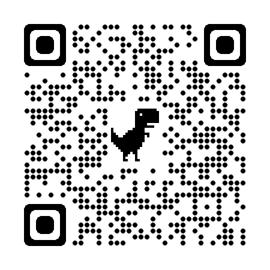

# stetri_web
## 用React打造Web3頁面

### 參考資料：
1. [胡家維 Hu Kenneth的medium](https://medium.com/my-blockchain-development-daily-journey/%E4%BD%BF%E7%94%A8-web3-js-%E5%B0%87-react-%E7%B6%B2%E7%AB%99%E9%9B%86%E6%88%90%E5%88%B0%E4%BB%A5%E5%A4%AA%E5%9D%8A%E7%B6%B2%E7%B5%A1-%E6%A1%88%E4%BE%8B%E7%A0%94%E7%A9%B6-nft-minting-%E7%B6%B2%E7%AB%99-786905c15c7c)
2. [foodchain的ithome](https://ithelp.ithome.com.tw/m/articles/10296218)
3. [Fullstack NFT Minting Dapp Using Next.js, Hardhat, Ethers.js, Alchemy, MetaMask, and TailwindCSS](https://javascript.plainenglish.io/fullstack-nft-minting-dapp-using-next-js-hardhat-ethers-js-alchemy-metamask-and-tailwindcss-145e0ef41d26)
4. [【開發筆記】NextJS+HTML 實作 ERC20 交易網站](https://medium.com/@anitahhl/%E9%96%8B%E7%99%BC%E7%AD%86%E8%A8%98-nextjs-html-%E5%AF%A6%E4%BD%9C-erc20-%E4%BA%A4%E6%98%93%E7%B6%B2%E7%AB%99-1f75a674a0bc)
5. [How to build an ERC-20 exchange platform](https://blog.logrocket.com/build-erc-20-exchange-platform/)
6. [AWS amplify](https://aws.amazon.com/tw/amplify/)
7. [AWS 建立 React 應用程式](https://aws.amazon.com/tw/getting-started/hands-on/build-react-app-amplify-graphql/)
8. [AWS新手的30天之旅 - 5. Amplify](https://ithelp.ithome.com.tw/articles/10237121)
9. [React components docs](https://react-bootstrap.netlify.app/components/alerts)
10. [Handling Events](https://reactjs.org/docs/handling-events.html)
11. [前端部署網頁的方式](https://ithelp.ithome.com.tw/articles/10281082?sc=hot)，但後來沒用到這個
12. [在AWS EC2部署Node.js web教學](http://dez.logdown.com/posts/2017/04/07/aws-ec2-deploy-nodejs-web-app)，這篇寫得很好，但我在設定EC2的時候不知道為什麼node.js一直有報錯，後來放棄ＸＤ
13. [React 建立分頁](https://www.geeksforgeeks.org/how-to-create-a-multi-page-website-using-react-js/)

### STEPs
在整裡過成的時後發現只有四個大的步驟，這是第一次做一個有分頁的網站，雖然小小的但弄了好久，哈哈哈哈哈～

#### Step 1. 建立網頁框架
- 先規劃網頁框架，先把[App.js](website/src/App.js)裡的架構寫好，Navbar是有框架之後才加上去的，把Navbar放在App.js的話，就不用每一頁去寫，本來我想把錢包連結也放在這邊，但是我實在太菜了，在傳送錢包地址給其他頁面的時候一直沒有成功，後來只好作罷，如果之後功力進步發現原因再更新ＸＤ
```javascript
<Router>
	<Navbar />
	<Routes>
		<Route exact path='/' element={<Home/>}/>
		<Route path='/token' element={<Token/>} />
		<Route path='/nft' element={<Nft/>} />
		<Route path='/us' element={<Us/>} />
		<Route path='/shop' element={<Shop/>} />
	</Routes>
	</Router>
```

#### Step 2. 連結錢包 Function
- [token](website/src/pages/token.js)和[nft](website/src/pages/nft.js)的頁面都有連結錢包的按鈕，其實應該還要再下一個判斷式，如果沒偵測到錢包的話跳警告，但最近工作真的太忙了，沒有空好好研究細節，就先做一個可以跑的版本出來。

```javascript
    //  建立一個開關去記錄有沒有connect
    const [isConnected, setConnected] = useState(false);
    // 建立一個開關去記錄有沒有登入
	const [isLogged, setLogged] = useState(false);
    // 建立一個變數把錢包地址接出來
	const [accounts, setAccounts] = useState();
    // 這下面都是交易的部分用的變數
    // 建立一個開關去記錄是不是在loading
	const [isLoading, setLoading] = useState(false);
    // 建立一個開關去記錄是不是交易成功
	const [finish, setfinish] = useState(false);
    // 建立一個變數把交易細節接出來
	const [txlink, settx] = useState();
    
	const connectWallet = async () => {
		if (isConnected === false){
		  if (window.ethereum) {
			const accounts = await window.ethereum.request({ 
			  method: 'eth_requestAccounts',
			});
			setAccounts(accounts); 
			setConnected(true);
			setLogged(true);
		  }
		}
		console.log(isLogged);
	  }
```
#### Step 3. 空投代幣 ＆ Mint NFT Function
1. [token](website/src/pages/token.js)和[nft](website/src/pages/nft.js)的頁面都有交易的按鈕，交易的function寫法其實大同小異，只token的transaction和mint要下不同的指令而已，詳細的可以直接到code裡面看，這裡記錄token transaction的部分。
```javascript
    // eth-goerli.g.alchemy API，也可以用INfura
    const node = contract_address.url
    // 建立provider
	const provider = new ethers.providers.JsonRpcBatchProvider(node)
    // 合約owner的私鑰（轉帳要用）
	const private_key = contract_address.private_key
    // 連結到owner錢包
	const wallet = new ethers.Wallet(private_key, provider)
    // 設定token地址
	const tokenaddress = contract_address.StetriTest
    // 讀取token ABI
	const sstani = STTcoin.abi
    // 讀取合約
	const contract = new ethers.Contract(tokenaddress, sstani, wallet)
    // 設定的測試鏈為Georli，ID是5
	const NETWORK_ID = '5'
    // 設定交易後要到etherscan查詢的地址 => hxlink＋交易的hash
	const hxlink = "https://goerli.etherscan.io/tx/"

	async function sendsst (to) {
        // 如果使用者連的測試鏈是goerli，就投5個token給他
		if (window.ethereum.networkVersion === NETWORK_ID) {
            // 這邊不要忘記設定decimals，不然止寫5的話會變成0.000...005
			const decimals = await contract.decimals();
            // 執行交易
			contract.transfer(to, ethers.utils.parseEther('5', decimals))
            // 把交易訊息讀出來
			.then(function(tx){
				console.log(tx);
                // 設定交裔狀態
				setfinish(true);
				settx(hxlink + tx.hash);
			})
		} else {
			alert("please switch to Georli testnet!")
		}	
	}
```
2. 設定不同狀態下，前端顯示不同的東西
```javascript
    // 當狀態不是isLoading的時候，顯示領取token按鈕
    {!isLoading && 
        <Button
            onClick={() => {setLoading(true);
                            sendsst(String(accounts));}
                    }
            aria-controls="example-collapse-text">
            GET 5 Stetri coins here! !
        </Button>
        }
    // 當狀態是isLoading，去判斷交易是否在進行中
    {isLoading &&
        <p>
            {/* 當交易還在進行，狀態不是finish的時候，顯示等待畫面 */}
            {!finish &&
            <p>Please wait a second...
            <Spinner animation="grow" />
            </p> 
                }
            {/* 交易完成，狀態變成finish的時候，顯示交易連結 */}
            {finish &&
            <p>Check your transaction 
            <a href={String(txlink)} target="_blank"> Here </a>
            </p>
            }
        </p>
    }	
```

#### Step 4. Deploy
- 上傳到github，然後連結AWS的Amplify服務就可以了，私鑰那些的可以在設定的時候手動輸入，就不用擔心.env檔案沒有上傳github讀不到參數的問題

#### 成果網址
- [Step Trip 踏步行](https://main.df8ieuo49110y.amplifyapp.com/)
- 另外我也有把領取Token和NFT的頁面，可以用matamask的手機App掃QR code，一樣可以領取Token喔！
    - Stetri coin
    
    - Stetri NFT
    

一邊上班一邊做side project真的是很累，但是又覺得好有成就感，好像看到自己的小孩成長的感覺，雖然我沒有小孩ＸＤ
真的超開心的！


